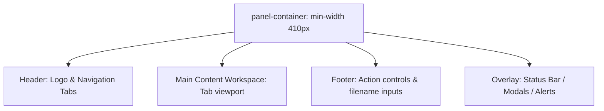

# MarkPull Design & Animation Specifications

This document defines the complete visual language, design system, component guidelines, iconography, and animation behaviors for the MarkPull Chrome Extension. It is designed to create a premium, glassmorphic, and high-satisfaction user experience that remains responsive, lightweight, and modern.

---

## 1. Design Philosophy

MarkPull is built around the concept of **Functional Satisfaction & Content-Centric Glassmorphism**. Since the application operates primarily as a Chrome Side Panel (`sidePanel` with a minimum width of `410px`), the UI must maximize horizontal space, use clean layouts, and provide micro-feedback on user actions to evoke precision and quality.

### Key Tenets
1. **Glassmorphism**: Layered glass cards with varying blur levels (`16px` to `32px`) and translucent borders to maintain visual depth and contextual connection to the underlying web pages.
2. **Dynamic Contrast**: Curated color palettes with a blend of soft organic background gradients and sharp, clean foreground elements.
3. **Micro-interactivity**: Every button, input, and list item reacts to hover, active, and focus states with customized, organic transitions.
4. **Monochrome Base with Colored Accents**: Primary interaction paths use a structured dark/light base, reserving vibrant colors for brand assets (AI logos) and warnings (errors/danger buttons).

---

## 2. Design Tokens

### 2.1 Theme & Color Palette
The extension supports three mode selections: **Light**, **Dark**, and **System**.

| CSS Variable | Light Theme Value | Dark Theme Value | Purpose / Description |
| :--- | :--- | :--- | :--- |
| `--font-sans` | `'Outfit', system-ui, sans-serif` | `'Outfit', system-ui, sans-serif` | Main typography for UI text & headings |
| `--font-mono` | `'JetBrains Mono', monospace` | `'JetBrains Mono', monospace` | Monospace typography for raw code & stats |
| `--bg-app` | `linear-gradient(135deg, #e5e2db, #d4d0c8)` | `linear-gradient(145deg, #0f131a 0%, #171b26 100%)` | Warm sand gradient (light) vs Deep navy gradient (dark) |
| `--bg-card` | `rgba(253, 251, 247, 1)` | `rgba(30, 35, 45, 0.95)` | Opaque warm-white card base vs Translucent dark card base |
| `--bg-modal` | `rgba(253, 251, 247, 1)` | `rgba(30, 35, 45, 0.98)` | Fully opaque cards for modal overlays |
| `--bg-button` | `rgba(0, 0, 0, 0.06)` | `rgba(255, 255, 255, 0.08)` | Semi-transparent background for button/input inputs |
| `--text-primary` | `#3d3b38` | `#f3f4f6` | Slate-brown (light) vs Warm gray-white (dark) for headings/text |
| `--text-secondary`| `#6e6b66` | `#9ca3af` | Muted neutral-gray for descriptions, titles, dates |
| `--border-glass` | `rgba(0, 0, 0, 0.15)` | `rgba(255, 255, 255, 0.06)` | Thin, high-contrast borders separating layers |
| `--hover-bg` | `rgba(0, 0, 0, 0.1)` | `rgba(255, 255, 255, 0.12)` | Darkening (light) vs Brightening (dark) hover overlay |
| `--active-bg` | `rgba(0, 0, 0, 0.15)` | `rgba(255, 255, 255, 0.18)` | Click/active overlay indicator |
| `--shadow-card` | `0 8px 24px rgba(0, 0, 0, 0.15)` | `0 16px 40px rgba(0, 0, 0, 0.3)` | Soft shadow giving elevation to cards |
| `--shadow-glow` | `0 0 10px rgba(0, 0, 0, 0.1)` | `0 0 15px rgba(255, 255, 255, 0.03)`| Subtle outer glow for buttons/hovered states |
| `--accent` | `#3b82f6` (System Blue) | `#60a5fa` (Soft Blue) | Interactive accents (active, links, focus outline) |
| `--radius-pill` | `12px` | `12px` | Rounded radius for inputs, buttons, status bars |
| `--radius-card` | `16px` | `16px` | Large rounded radius for container cards & panels |
| `--active-text` | `#ffffff` | `#0f131a` | High-contrast text placed on active solid backgrounds |
| `--icon-filter` | `none` | `invert(1)` | Vector mask inverter for specific light logo assets |

---

## 3. Visual Layout & Structure

The extension side panel follows a strict top-down flex layout:



### 3.1 panel-container
- **Properties**: `display: flex`, `flex-direction: column`, `height: 100vh`, `padding: 12px`, `gap: 8px`.
- **Sizing constraints**: Minimum width of `410px` ensures all elements stack elegantly without clipping horizontal margins.

### 3.2 Main Content Viewport
- **Flex-grow**: `flex: 1` to fill all remaining vertical space.
- **Scroll behavior**: `overflow: hidden` on viewport parent, with `overflow-y: auto` inside individual component containers (e.g., Markdown editor, file lists, chat history).

### 3.3 Workspace View Modes
When in the `extract` tab, the workspace layout displays markdown in three potential states controlled by the view selector:
1. **Split View (`view-split`)**: Height divided equally (`50%` each) using dynamic flex layout. Displays Raw Preview (editable) on top, and Rendered Preview (compiled HTML) below.
2. **Raw View (`view-raw`)**: Raw pane fills the entire workspace (`100%` height). Rendered pane is hidden (`display: none`).
3. **Rendered View (`view-rendered`)**: Rendered pane fills the entire workspace. Raw pane is hidden.

---

## 4. Typography

MarkPull relies on two primary font stacks loaded from Google Fonts to achieve clean, readable typography:

### 4.1 UI Sans Serif Stack
- **Font Family**: `'Outfit', system-ui, -apple-system, sans-serif`
- **Weights**:
  - `400` (Regular): Default body text, button labels, descriptions.
  - `500` (Medium): UI tab buttons, folder/file titles, modal headers.
  - `600` (Semi-Bold): Important headers, active indicators.
- **Line Height**: `1.6` for optimal readability.

### 4.2 Raw Code & Monospace Stack
- **Font Family**: `'JetBrains Mono', monospace, 'Courier New'`
- **Purpose**: Used for the raw markdown preview, character/word counters, filenames, and console logs.
- **Size**: Scaled to `0.85rem` inside code blocks.

### 4.3 Markdown Render styling (`.markdown-body`)
Markdown rendering features clear hierarchy mappings to support structured reading:
- **Headings**: `h1`, `h2`, `h3` use `font-weight: 500`, dynamic top/bottom margins, and subtle letter-spacing: `-0.02em`.
- **Paragraphs**: Styled using `--text-secondary` (`#6e6b66` or `#9ca3af`) to reduce eye strain.
- **In-line code**: Highlighted using `--bg-button` background padding, with a border radius of `6px` and font size scaled to `0.85em`.
- **Fenced code blocks (`pre`)**: Styled with `background: rgba(0,0,0,0.2)`, `border: 1px solid var(--border-glass)`, and a custom padding of `16px`.

---

## 5. Iconography

MarkPull uses a hybrid iconography system combining optimized raw SVG assets for brand identity and standard **Lucide React** icons for functional interactions.

### 5.1 SVG Brand Assets
These are hosted in the `src/assets` folder:
- `logo-light.svg` / `logo-dark.svg`: Core brand identity, loaded dynamically based on active theme state.
- `copy-to-ai.svg`: Custom multi-action quick-launch vector, uses CSS `--icon-filter: invert(1)` in dark mode.
- **AI Providers**: Brand-accurate SVGs that scale to `16px` or `22px` within prompt targets:
  - `openai.svg` (ChatGPT)
  - `claude-color.svg` (Claude)
  - `deepseek-color.svg` (Deepseek)
  - `gemini-color.svg` (Gemini)

### 5.2 Lucide React Mapping
All vector symbols must use the standard Lucide design language with a consistent weight.

| Icon Component | Sizing (px) | Default Color / Stroke | Contextual Usage |
| :--- | :--- | :--- | :--- |
| `Edit3` | `16` | `var(--text-secondary)` | Extraction tab navigations |
| `Library` | `16` | `var(--text-secondary)` | Saved project library navigation |
| `MessageSquare`| `16` | `var(--text-secondary)` | AI assistant chat tab navigation |
| `Settings` | `16` | `var(--text-secondary)` | Extension configurations tab |
| `ChevronDown` | `14` | `var(--text-primary)` | Dropdown triggers |
| `MousePointer2`| `14` | `var(--text-primary)` | Picking section manual extractor |
| `ScanText` | `14` | `var(--text-primary)` | Auto-detect main content extractor |
| `Maximize` | `14` | `var(--text-primary)` | Full page parser extractor |
| `Columns` | `16` | `var(--text-secondary)` | Split preview toggle |
| `FileCode` | `16` | `var(--text-secondary)` | Raw markdown preview toggle |
| `FileText` | `16` | `var(--text-secondary)` | Rendered markup preview toggle |
| `Copy` | `14` | `var(--text-secondary)` | Copy to clipboard actions |
| `Download` | `14` | `var(--text-secondary)` | File download action triggers |
| `Save` | `14` | `var(--text-secondary)` | Save to Drive project prompts |
| `Folder` | `42` | `var(--accent)` | Project folder items in Library (stroke width: `1`) |
| `MoreVertical` | `16` | `var(--text-secondary)` | Action menu expansion toggles |
| `Cloud` | `14` | `var(--text-primary)` | Open in Google Drive actions |
| `Share2` | `14` | `var(--text-primary)` | Share drive links |
| `Trash2` | `14` | `#ef4444` (Danger red) | File/folder deletion requests |
| `Send` | `16` | `var(--active-text)` | Submit prompt to AI model |
| `Check` | `12` | `var(--accent)` | Selection confirmation indicator |
| `Loader2` | `14` | `var(--text-secondary)` | Waiting state animation |
| `X` | `14` | `white` | Cancel active picker state button |

---

## 6. Animation & Interaction Specifications

Transitions and animations are central to MarkPull's premium feel. Standard browser snaps are replaced by smooth, high-fidelity bezier curves and keyframes.

### 6.1 Easing & Timing Constants
- **Standard Transition**: `all 0.2s cubic-bezier(0.25, 0.46, 0.45, 0.94)` (Visual feedback speed, rapid start with gentle decrescendo).
- **Fade Transitions**: `0.2s ease-out`
- **Entrance Transitions**: `0.3s cubic-bezier(0.16, 1, 0.3, 1)` (Ultra-premium ease-out for overlays).

```
Visual Bezier Curves comparison:
  Linear:      [========================================]
  Standard:    [====       ====       ====          ====]
  Cubic-Out:   [========          ====      ==         ] <-- Rapid acceleration, soft settling (Preferred)
```

### 6.2 Global Keyframe Definitions
These keyframes are declared inside the CSS engine to support smooth entry, loader, and accent state cues:

```css
/* 1. Page/tab fading entry */
@keyframes fadeIn {
  from {
    opacity: 0;
    transform: translateY(4px);
  }
  to {
    opacity: 1;
    transform: translateY(0);
  }
}

/* 2. Status message entry from bottom */
@keyframes fadeUp {
  from {
    opacity: 0;
    transform: translateY(4px);
  }
  to {
    opacity: 1;
    transform: translateY(0);
  }
}

/* 3. Infinite spin for loading / refresh cues */
@keyframes spin {
  100% {
    transform: rotate(360deg);
  }
}

/* 4. Active AI Glow / Pulse effect */
@keyframes pulse {
  0%, 100% {
    opacity: 0.4;
    transform: scale(1);
  }
  50% {
    opacity: 0.8;
    transform: scale(1.05);
  }
}
```

---

## 7. Micro-Animations Guide

Micro-animations are applied to interactive states to simulate tactile responsiveness.

### 7.1 Interactive Elements State Matrix

| Element Class | State | CSS Transform | Background/Border Styles | Shadow/Glow Styles | Animation Timing |
| :--- | :--- | :--- | :--- | :--- | :--- |
| **All Buttons** | Default | `none` | `var(--bg-button)` | `none` | `0.2s cubic-bezier` |
| | Hover | `translateY(-1px)` | `var(--hover-bg)` | `var(--shadow-glow)` | `0.2s cubic-bezier` |
| | Active | `scale(0.96) translateY(0)` | `var(--active-bg)` | `none` | `0.1s cubic-bezier` |
| | Disabled| `none` | `opacity: 0.4` | `none` | Instant |
| **Primary Buttons**| Hover | `translateY(-1px) scale(1.02)` | `opacity: 0.9` | `var(--shadow-glow)` | `0.2s cubic-bezier` |
| | Active | `scale(0.96) translateY(0)` | `opacity: 1` | `none` | `0.1s cubic-bezier` |
| **Tab Buttons** | Active | `none` | `var(--text-primary)` | `0 2px 8px rgba(0,0,0,0.1)`| `0.3s ease` |
| **Library Folder** | Default | `none` | `transparent` | `none` | `0.2s ease` |
| | Hover | `translateY(-2px)` | `var(--hover-bg)` | `var(--shadow-card)` | `0.2s ease` |
| | Active | `scale(0.98)` | `var(--hover-bg)` | `none` | `0.1s ease` |

### 7.2 Micro-interactions Walkthroughs

#### 7.2.1 Document Selection / Picker Highlight
When user activates the **Picker mode** to manually extract content:
- **Hover on Page Element**: Injected class `.markpull-highlight-hover` triggers a soft colored outline using `outline: 2px solid var(--accent)` with a smooth transition.
- **Selection Event**: Clicking an element applies `.markpull-highlight-selected`. The outline snaps to a solid border and applies a translucent background color pulse to indicate captured status.

#### 7.2.2 Active AI Targets (Quick-Paste Buttons)
When the extension detects an active AI tab in the browser (e.g. Claude, ChatGPT, Gemini, Deepseek):
- The corresponding floating circular button enters with a fade-in transition.
- An animated background ring (`animation: pulse 2s cubic-bezier(0.4, 0, 0.6, 1) infinite`) matches the specific brand color (e.g., `#8e75ff` for Gemini, `#10a37f` for OpenAI) and creates a soft glowing ring behind the icon.
- This draws user attention, indicating that the system is ready to **automatically inject and paste** the copied markdown directly into that AI prompt box with one click.

#### 7.2.3 Status Messages & Notifications
- **Trigger**: Actions like "Copied to clipboard", "Downloaded", or "Saving" fire a status toast.
- **Entrance**: Absolute positioned container at bottom-right performs a `fadeUp` entry (`animation: fadeUp 0.3s forwards ease-out`).
- **Dismissal**: Stays active for `3000ms`, then slides down and fades out using the reverse cubic-bezier curve.

#### 7.2.4 Library Folder Hover Options
- **Default State**: Folder items display names and files. Options button (`MoreVertical`) and actions are hidden (`opacity: 0`).
- **Hover State**: Hovering over the folder card shifts the card up by `-2px` (`translateY(-2px)`), increases card shadow depth, and transitions the options button opacity from `0` to `1` over `200ms` so users can perform operations (Rename, Delete, Link Share) cleanly without visual clutter.

---

## 8. High-Fidelity UI Component Guidelines

### 8.1 The Tab Pill Selector
Located at the header, this custom navigation tab container uses a rounded pill background and contains icon-only buttons.
- **Layout**: `display: flex`, `align-items: stretch`, `background: transparent`, `padding: 4px`, `gap: 4px`.
- **Tactile feedback**: Hovering over a tab button transitions the icon color. Active tab buttons slide into a solid white (`#ffffff` in light mode) background card using a soft drop shadow, creating a satisfying visual selection state.

### 8.2 Google Drive Quota Bar
Found in settings, it displays the visual storage metrics of the authenticated Google Drive account.
- **Visual styling**: A progress background using `--bg-button` and a dynamic progress filler width bound to the account usage percentage.
- **Filler background**: Colored with `--accent` (`#3b82f6` or `#60a5fa`) to visually display storage consumption metrics at a glance.
